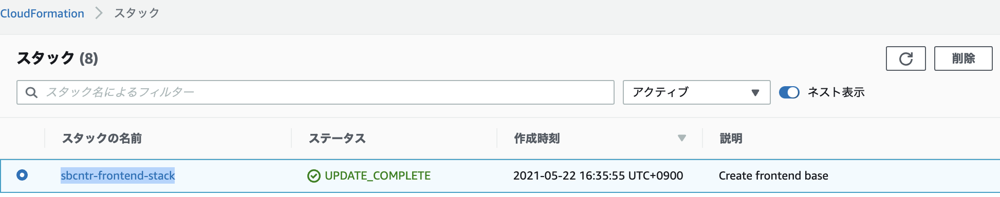
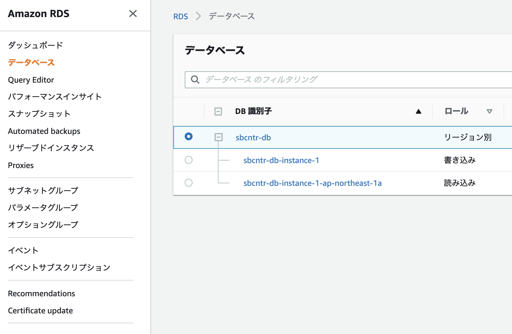
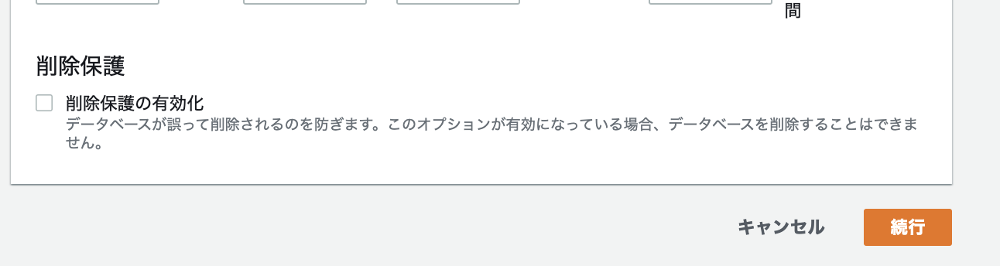
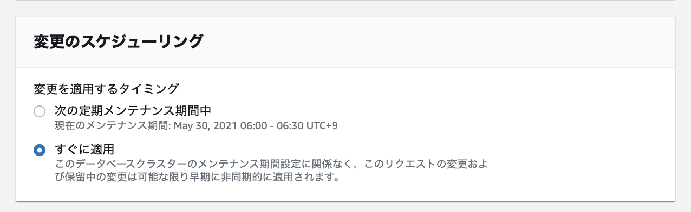
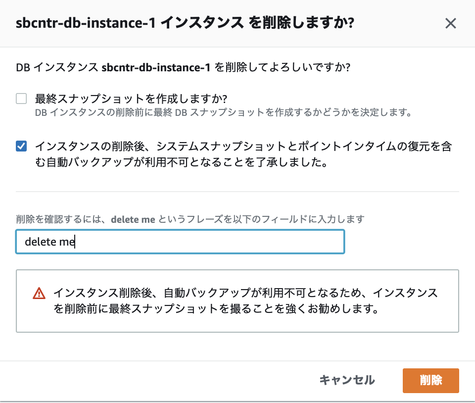

# 作成したリソースの消し方

## 概要

本ドキュメントでは、書籍「xxx」で作成したリソース群の削除手順について記載します。
本書籍で作成したリソースは、作成方法に応じて削除方法が異なります。

- IaCで作成したリソース
- AWS マネジメントコンソールから手動で作成したリソース

前者については、<xxx> のREADME.md(<xxx>) を参考にしてください。
後者についてはコンソールからステップを踏んで作成していきましたので、削除も地道にする必要があります。頑張って消していきましょう。
次の手順は後者のコンソールから作成した際の削除手順になります。

## 削除手順

### ECR

#### Frontend用ECR

- 左ペインからリポジトリを選択します。
- sbcntr-frontendの選択し、削除します。

#### Backend用ECR(TODO)

- 左ペインからリポジトリを選択します。
- sbcntrdemoの選択し、削除します。

以上でECRは完了です。

### ECS

今回作成したECSはフロントエンドアプリケーション用とバックエンドアプリケーション用がありました。それぞれを削除します。

#### Frontend用

今回、フロントエンドアプリケーション用のECSクラスタはCloudFormationから作成しました。CloudFormationのスタックを削除しましょう。

- CloudFormationのダッシュボードに遷移します。
- 対象のスタック(sbcntr-frontend-stack)を選択します。
- 削除ボタンを押します。

    

- 確認ポップアップが表示されます。そのまま削除を押下します。
- スタック一覧に戻り、対象のスタックが削除されたことを確認します。
- ECSのダッシュボードに行き、フロントエンドアプリケーション用のECSクラスタ(sbcntr-frontend-cluster)が削除されたことを確認します。

#### Backend用(TODO)

続いて同様の手順でバックエンドアプリケーション用のECSクラスタも削除します。

- 左ペインからクラスタ(sbcntr-frontend-cluster)を選択します。
- タスクタブを選択し、すべてを停止を押します。
- すべてのタスクが停止したことを確認します。
- クラスタの削除ボタンを押します。ポップアップの説明に従って削除してください。
  
- クラスタが削除されたことを確認します。

以上でECSは完了です。

### Cloud9(TODO)

- 2つのインスタンス（管理用と開発用）を順番に削除します。ポップアップの説明に従って削除してください。
- 削除処理が進みます。これには時間がかかるのでしばらくしてから再度Cloud9のダッシュボードを訪問し、削除されていることを確認してください。

以上で、Cloud9は完了です。

### Code系サービス(TODO)

ここはまとめて削除をしていきます。

#### CodePipeline

- 左ペインのパイプラインから、対象のパイプライン（sbcntr-pipeline）を選択します。
- パイプラインを削除するを押し、ポップアップの説明に従って削除してください（deleteと入力し、チェックボックスはそのままに、削除ボタンを押してOKです）。

#### CodeDeploy

- 左ペインのアプリケーションから、対象のアプリケーションのリンクを選択します。
- アプリケーションを削除ボタンを押して、ポップアップの説明に従って削除してください。

#### CodeBuild

- 左ペインのビルドプロジェクトから、対象のプロジェクト（sbcntr-codebuild）を選択します。
- ビルドプロジェクトの削除を押し、ポップアップの説明に従って削除してください。

#### CodeCommit

- 左ペインのリポジトリから、対象のリポジトリ（sbcntr-repo）を選択します。
- リポジトリの削除を押し、ポップアップの説明に従って削除してください。

以上で、Code系サービスの削除は完了です。

### RDS

- 左ペインのデータベースから、対象のクラスタ（sbcntr-db）を選択します。
    

- sbcntr-dbにチェックを入れ、変更を押します。
- 一番下にある、「削除保護」から「削除保護」のチェックを外し、次へを押します。

    

- 「変更のスケジュール」ですぐに変更を選択し、クラスタの変更を押してください。

    

- 少し時間をおきます（1分ほど）
- sbcntr-dbのツリーを展開し、ロールが読み込みとなっているデータベースを選択します。
- アクションボタンから削除を押してください。
- 同様に、ロールが書き込みとなっているデータベースも削除してください。
- ポップアップ画面では、最終スナップショットの作成のチェックはせず、了承のチェックボックスにチェックを入れて削除してください。

    

以上で、RDSの削除は完了です。時間をおいてデータベースが削除されていることを確認しておいてください。

### Load Balancer

#### Frontend用ALB

CloudFormationの削除ですでに完了しています。

#### Backend用ALB(TODO)

- EC2のダッシュボードへ遷移します。
- 左ペインからロードバランサーを選択します。
- 対象のロードバランサー（sbcntr-alb-ingress）を選択し、リスナータブからすべてのリスナーにチェックを付け、削除を押してください。
- 左ペインからターゲットグループを選択します。
- すべてのターゲットグループを選択し、アクションボタンから削除を押してください。
- ロードバランサーへ戻り、アクションボタンからロードバランサーを削除してください。

以上で、Load Balancerの削除は完了です。

### VPCエンドポイント(TODO)

### VPC(TODO)

VPCを削除することでVPCに関わるリソース（サブネット、ルートテーブルなど）を一括削除できます。

- 左ペインからVPCを選択します。
- 対象のVPC（sbcntr-vpc）にチェックを入れて、アクションボタンから削除を押します。
- ポップアップが表示され、大量のリソースを削除するよ、という記載があります。削除しましょう。
- 削除モーダルの処理を待ちましょう（たまに失敗するようなので失敗したら再度削除してみましょう）。
- 削除が完了した旨が表示されたらOKです。サブネット、ルートテーブル、インターネットゲートウェイなど作成したリソース群を見て回ってください。削除されていることが確認できるはずです。

以上で、VPC周りの削除は完了です。

### EIP(TODO)

Cloud9インスタンスに紐付けたEIPです。VPCの削除では、EIPは削除されないため、消しておきましょう。

- EC2のダッシュボードへ遷移します。
- 左ペインからEIPを選択します
- 対象のEIPを選択し、アクションから、EIPを削除します。

以上で、EIPの削除は完了です。

### CloudWatch(TODO)

- 左ペインからルールを選択します。
- 対象のルールを削除します。
- 左ペインからロググループを選択します。
- “sbcntr”とついたロググループをそれぞれ選択し、アクションから削除してください。
  - 辛抱強く削除お願いします。

以上で、CloudWatchの削除が完了です。

### S3(TODO)

- バケットから、sbcntrとついたバケットをチェックします。CodePipelineのバケットが作られているはずです。
- 削除ボタンを押します。ポップアップの説明に従って削除してください。

以上で、S3の削除が完了です。

### IAM(TODO)

- 左ペインからロールを選択します。
- フィルタ条件でsbcntrのロールに絞り込みます。
- フィルタリングされた結果のロールすべてにチェックを付けて、ロールの削除を押します。
- 左ペインからポリシーを選択します。
- ポリシーのフィルタで、ユーザによる管理のポリシーに絞り込みます。
- ロールと違い、一気に削除ができないため辛抱強く削除をします。

以上で、IAMの削除が完了です。

### WAF(TODO)

- 左ペインからWebACLを選択します。
- 真ん中にあるドロップダウンリストを選択（Globalと記載されているリスト）し、Tokyoリージョンに切り替えます。
- 対象のWebACLを選択し、Deleteを押します。ポップアップの説明に従って削除してください。
- 左ペインからRule groupsを選択します。
- 対象のRule groupsを選択し、Deleteを押します。ポップアップの説明に従って削除してください。

以上で、WAFの削除が完了です。

### Systems Manager(TODO)

- 左ペインからパラメータストアを選択します。
- フィルタ条件として、"sbcntr"で絞り込みます。
- フィルタ条件で絞り込んだパラメータストアをすべて選択し、削除を押します。

以上で、Systems Managerの削除が完了です。

### Secret Manager(TODO)

### CloudFormation(TODO)

もしスタックが残っている場合は削除しましょう。

- 左ペインのスタックを選択します。
- “sbcntr”とついている、CloudFormationのスタックにチェックをつけます。
- 削除を押します。ポップアップの説明に従って削除してください。
  - 
